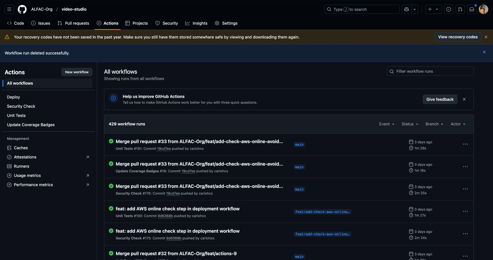

# Video Studio ·  

Repositório para o projeto de hackathon (2024 - 7SOAT - Grupo 34) do curso de Arquitetura de Software da FIAP Pós Tech. O projeto gerencia o envio e processamento de vídeos, transformando em imagens em um arquivo `.zip`. Além do cadastro e autenticação dos usuários desta plataforma.

> [!WARNING]
> Para completo funcionamento da plataforma, é necessário seguir todo o fluxo de provisionamento:
> 1. A provisão da infraestrutura [https://github.com/ALFAC-Org/video-studio](https://github.com/ALFAC-Org/video-studio);
> 2. A provisão das lambdas [https://github.com/ALFAC-Org/video-serveless-function](https://github.com/ALFAC-Org/video-serveless-function);
> 2. A provisão deste repositório.

## Arquitetura

### Visão Geral

A aplicação está estruturada no padrão de Hexagonal.

Pode ser executada tanto via Docker, Kubernetes e Terraform.

Podendo ser hospedada tanto localmente ou na nuvem, usando serviços como AWS.

A interação da aplicação se dá através de APIs com o Swagger disponibilizado.

### Fluxo


Veja também no [documento no Miro](https://miro.com/app/board/uXjVKZNCxxM=/?moveToWidget=3458764613694478390&cot=14).

### Qualidade

A aplicação possui checagem de qualidade do código através da action [https://github.com/ALFAC-Org/video-studio/actions/workflows/unit-tests.yaml](https://github.com/ALFAC-Org/video-studio/actions/workflows/unit-tests.yaml). Qualquer erro na action, o _build_ da aplicação falhará. Uma vez corrigido, o _build_ continuará noralmente.

### Segurança

A aplicação possui checagem de segurança dos pacotes instalados através da action [Security Check](https://github.com/ALFAC-Org/video-studio/actions/workflows/security-check.yaml). Caso exista algum pacote que precisa ser atualizado e que seja considerado de atualização gravíssima, (nível 10 do [https://hub.docker.com/r/owasp/dependency-check]([https://hub.docker.com/r/owasp/dependency-check])), o _build_ da aplicação falhará. Uma vez corrigido, o _build_ continuará normalmente.

## Como rodar o projeto

Variáveis a se trocar:

- APPLICATION_VERSION
- ENABLE_FLYWAY
- SPRING_DATASOURCE_URL
- SPRING_DATASOURCE_USERNAME
- SPRING_DATASOURCE_PASSWORD

Existem duas formas com as quais você pode ver esse repositório em ação:

- **Via GitHub Actions (recomendada)**
- Localmente

### Via GitHub Actions (recomendada)

<details>
  <summary>Passo a passo</summary>

1. Acesse [https://github.com/ALFAC-Org/video-studio/actions](https://github.com/ALFAC-Org/video-studio/actions) (A guia `Actions` deste repositório);
2. Acesse `Deploy`;
3. Clique em `Run workflow` (ou Executar workflow);
4. Aguarde. Se tudo der certo, o `check` verde deverá aparecer - o processo dura em torno de 1 minuto;
   1. 
5. Para acessar a aplicação, acesse a plataforma AWS > EC2 > Load Balancer

A url final será:

[http://url-do-load-balancer:8080/api-docs](http://url-do-load-balancer:8080/api-docs)
</details>

### Localmente

<details>
  <summary>Passo a passo</summary>

#### Requisitos

- Docker e Kubernetes

1. **Clone este repositório**:

```bash
git clone https://github.com/ALFAC-Org/video-studio
```

2. **Acesse o diretório do repositório**:

```bash
cd video-studio
```

3. **Aplique as configurações**:

```bash
kubectl apply -f k8s/dev/shared
```

```bash
kubectl apply -f k8s/dev/backend
```

4. **Acesse a aplicação no endereço**:
[http://localhost:30001/api-docs](http://localhost:30001/api-docs)

</details>

## Membros

| Nome | RM | E-mail | GitHub |
| --- | --- | --- | --- |
| Leonardo Fraga | RM354771 | [rm354771@fiap.com.br](mailto:rm354771@fiap.com.br) | [@LeonardoFraga](https://github.com/LeonardoFraga) |
| Carlos Henrique Carvalho de Santana | RM355339 | [rm355339@fiap.com.br](mailto:rm355339@fiap.com.br) | [@carlohcs](https://github.com/carlohcs) |
| Leonardo Alves Campos | RM355568 | [rm355568@fiap.com.br](mailto:rm355568@fiap.com.br) | [@lcalves](https://github.com/lcalves) |
| Andre Musolino | RM355582 | [rm355582@fiap.com.br](mailto:rm355582@fiap.com.br) | [@amusolino](https://github.com/amusolino) |
| Caio Antunes Gonçalves | RM354913 | [rm354913@fiap.com.br](mailto:rm354913@fiap.com.br) | [@caio367](https://github.com/caio367) |
